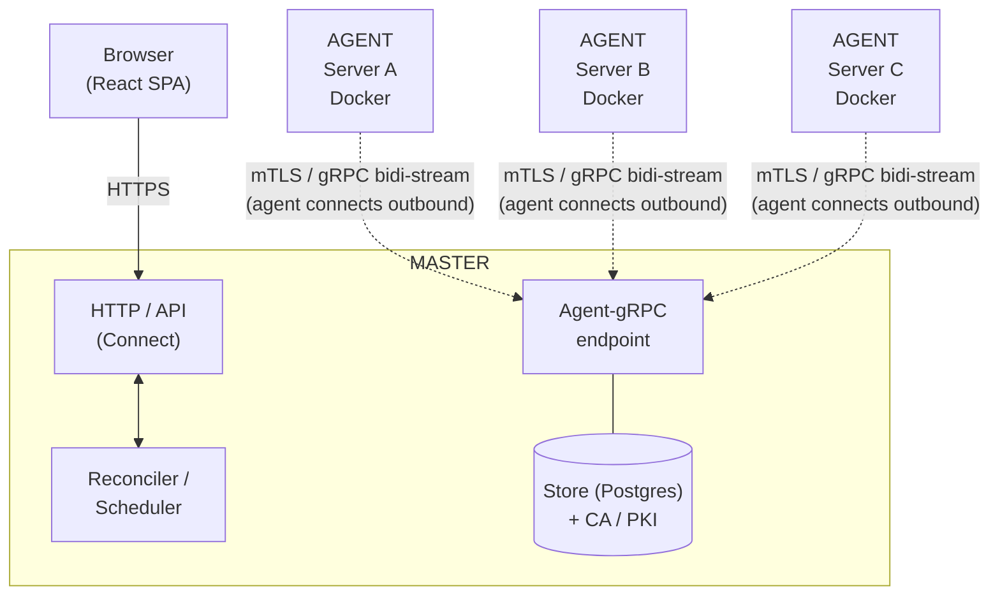

# orkestra

Lightweight orchestrator for Docker/Compose hosts — a simpler alternative to Kubernetes or Nomad when all you need is centrally managed, self-healing Compose stacks across multiple Linux servers.

> ⚠️ **Work in progress.** orkestra is under active development and **not yet production-ready** —
> APIs, schemas, and features may change without notice. See the [open roadmap issues](https://github.com/heckertobias/orkestra/issues?q=is%3Aopen+label%3Aroadmap) for an
> incomplete list of what's still open.

## Why orkestra?

Plain "SSH + docker compose" is not centrally controllable, not self-healing, and not auditable. Kubernetes and Nomad are too heavy for standalone Docker hosts. orkestra fills this gap.

- A lightweight **Agent** (single Go binary, no runtime) runs on every Linux server and manages containers via the Docker Engine API.
- A central **Master** holds Desired State in PostgreSQL, distributes it to Agents, and exposes a **Web UI**.
- Agents connect **outbound** to the Master — NAT and firewall friendly, authenticated via **mTLS**.

> **Status:** the core loop — enroll an agent, define a Compose stack, assign it, and have the agent
> pull images and run/heal containers — works end-to-end. Some features are still in progress (live
> logs/stats/exec, named networks/volumes, secret injection, fleet updates). See
> the [roadmap issues](https://github.com/heckertobias/orkestra/issues?q=is%3Aopen+label%3Aroadmap) for what's planned and what's partial.

## Architecture



## Core Principles

- **Single source of truth** — Master holds Desired State in PostgreSQL; Agents are stateless with respect to configuration.
- **Connect-out** — Agents initiate the connection; the Master never dials out. NAT/firewall friendly.
- **Reconciliation over imperative** — Agents continuously converge toward desired state and report drift back.

## Tech Stack

| Layer | Choice |
|---|---|
| Language | Go ≥ 1.24 |
| RPC / API | ConnectRPC (gRPC + browser-native, one schema) |
| Docker control | Docker Engine SDK + compose-go |
| Persistence | PostgreSQL + sqlc (pgx/v5) + goose migrations |
| Auth | argon2id (local) + OIDC (optional) |
| Secrets | Built-in encrypted store (XChaCha20-Poly1305 + KEK); OpenBao backend planned |
| Frontend | React + TypeScript + Vite + Tailwind + TanStack Query |
| Packaging | goreleaser — single binary, systemd units, Docker image |

The React SPA is embedded into the Master binary via `go:embed` — one artifact serves both API and UI.

## Quick Start

### Master (Docker Compose)

```bash
# DB password only — safe in .env
export POSTGRES_PASSWORD=$(openssl rand -hex 24)
echo "POSTGRES_PASSWORD=$POSTGRES_PASSWORD" >> .env

# KEK lives in a separate file — never in .env
mkdir -p deploy/docker/secrets
openssl rand -hex 32 > deploy/docker/secrets/master_key
chmod 600 deploy/docker/secrets/master_key
# Back this file up separately — it encrypts the CA key and all secrets at rest.

docker compose -f deploy/docker/compose.yaml up -d
docker compose -f deploy/docker/compose.yaml logs master | grep "setup"
# Open the setup URL to create the first admin user.
```

### Agent

Install from the package repository (Debian/Ubuntu shown; Fedora/RHEL via `dnf` — see
[docs/08-deployment.md](docs/08-deployment.md#install-via-apt--dnf-packages)):

```bash
curl -fsSL https://heckertobias.github.io/orkestra/orkestra.gpg \
  | sudo tee /usr/share/keyrings/orkestra.gpg >/dev/null
echo "deb [signed-by=/usr/share/keyrings/orkestra.gpg] https://heckertobias.github.io/orkestra/apt stable main" \
  | sudo tee /etc/apt/sources.list.d/orkestra.list
sudo apt update && sudo apt install orkestra-agent

# enroll once (get a token from the UI: Servers → Add Server), then start:
sudo orkestra-agent enroll --master https://master.example.com:4440 --bootstrap-token <token> --name web-01
sudo systemctl enable --now orkestra-agent
```

Updates are then just `sudo apt update && sudo apt upgrade`. The
[`install-agent.sh`](deploy/install-agent.sh) script remains as a fallback for hosts without the repo.

## Development

**Prerequisites:** Go 1.24+, buf, sqlc, Docker, Node 20+

### Start a local dev instance

```bash
./run-dev.sh
```

The script starts a Postgres container (`orkestra-dev-pg`), builds the dev binary, and launches the Master and the Vite dev server. Both are stopped cleanly when you press Ctrl+C or the terminal closes.

| URL | Purpose |
|---|---|
| http://localhost:8080 | Master UI & API |
| http://localhost:5173 | Vite dev server (HMR) |
| http://localhost:9090/metrics | Prometheus metrics |

On the very first run the Master prints a one-time setup URL — open it to create the admin account.

**Customising ports:** copy `.env.example` to `.env` and uncomment the relevant lines. The `.env` file is gitignored.

```bash
cp .env.example .env
# edit .env, then:
./run-dev.sh
```

### Individual make targets

```bash
make proto    # buf generate → Go + TypeScript stubs
make sqlc     # sqlc generate → type-safe DB layer
make build    # go build ./cmd/...
make test     # go test ./...
make web      # npm run build in web/
```

### Logs

```
/tmp/orkestra-master.log
/tmp/orkestra-vite.log
```

## Documentation

- [docs/00-overview.md](docs/00-overview.md) — Architecture overview
- [docs/01-repo-layout.md](docs/01-repo-layout.md) — Repository structure & build tooling
- [docs/02-protocol.md](docs/02-protocol.md) — gRPC/Connect protocol
- [docs/03-data-model.md](docs/03-data-model.md) — PostgreSQL schema
- [docs/04-reconciliation.md](docs/04-reconciliation.md) — Desired-State model & Converge Engine
- [docs/05-secrets.md](docs/05-secrets.md) — Built-in secret store, CRUD, reveal, audit
- [docs/06-security-auth.md](docs/06-security-auth.md) — PKI/mTLS, user auth, RBAC, audit
- [docs/07-web-ui.md](docs/07-web-ui.md) — UI pages & frontend stack
- [docs/08-deployment.md](docs/08-deployment.md) — Observability & deployment
- [Roadmap (GitHub issues)](https://github.com/heckertobias/orkestra/issues?q=is%3Aopen+label%3Aroadmap) — Planned features, partial foundations & known gaps, tracked as issues (labels `planned` / `partial` / `idea`)

## License

MIT — see [LICENSE](LICENSE).
