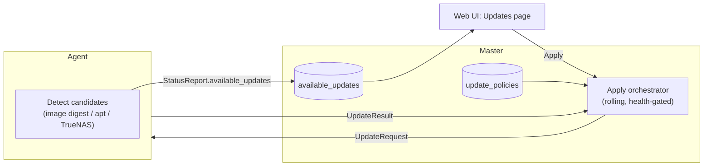

# orkestra — Roadmap & Planned Features

This is the single place that tracks **everything not yet built**: planned features, partially
landed foundations, and open design questions. The `docs/` directory describes what orkestra
**actually does today**; anything aspirational lives here.

**Status legend**

| Tag | Meaning |
|---|---|
| 🚧 | Foundation exists in the codebase; the end-to-end feature is incomplete |
| 🔲 | Planned; not started |
| 💡 | Idea / open design question — not yet committed to |

---

## 1. Update System (fleet updates)

Keep a fleet up to date across **three layers**, configurable **per agent and per layer** — each
either **manual** (surface "update available", apply on click) or **automatic** (apply within an
optional maintenance window):

1. **orkestra binaries** — the Master and Agent themselves.
2. **Stack images** — the container images of managed Compose stacks.
3. **Host OS** — operating-system package updates (apt/unattended-upgrades, TrueNAS updates).

The Master is the control point; agents connect outbound only (see `docs/02-protocol.md`), so all
update commands ride the existing mTLS stream and all "what's available" data is agent-reported —
the same pattern used for [federated metrics](docs/08-deployment.md#federated-agent-metrics).

### What already exists (🚧 foundation)

- **Schema** — migration `internal/master/store/migrations/00010_update_policies.sql`:
  - `update_policies` — one row per `(server_id, layer)`; `mode` (`manual`/`automatic`),
    `window_cron`, `auto_reboot`; a `NULL` `server_id` row is the fleet default (partial unique
    indexes enforce this). Agent-specific row wins over the fleet default.
  - `available_updates` — one row per `(server_id, layer)`; `current`/`candidate` version,
    `detail jsonb`, `detected_at`.
- **Queries** — `internal/master/store/queries/updates.sql` (upsert agent/fleet policy,
  `ResolveUpdatePolicy`, list policies, upsert/list/delete available updates).
- **Wire format** — `StatusReport.available_updates` (field 3) + `AvailableUpdate{layer,current,candidate}`
  in `proto/orkestra/v1/agent.proto`.
- **Persistence** — `Handler.handleStatusReport` (`internal/master/agentgw/handler.go`) upserts any
  reported `available_updates` into the table. (Persistence only — no apply logic.)
- Covered by store/handler integration tests in `internal/e2e/updates_test.go` (they inject a
  synthetic `StatusReport`; no real agent reports updates yet).

### What is still missing (🔲)

- **Agent detection/reporting** — the agent never populates `available_updates`. Needs:
  registry digest comparison for images (extend `ensureImage` in
  `internal/agent/compose/converge.go`), `apt-get -s upgrade` / TrueNAS update-API probing for OS,
  and Master-side version comparison for the orkestra binary.
- **Apply RPCs** — `UpdateRequest{layer,target,allow_reboot}` / `UpdateResult{success,from,to,reboot_required,error}`
  on the Master→Agent stream (`proto/orkestra/v1/agent.proto`), correlated by `request_id`.
- **Per-layer apply behaviour**
  - *orkestra (container agent, TrueNAS/Docker):* pull new image tag and recreate — touches the
    self-management edge (see open questions).
  - *orkestra (systemd agent):* download signed binary, verify checksum/signature, swap
    `/usr/local/bin/orkestra-agent`, restart the unit.
  - *orkestra (Master):* updated last, out of band (Compose/systemd), never by an agent.
  - *images:* re-resolve digests and redeploy affected stacks through the normal converge path.
  - *os:* run the package manager; if `reboot_required` and `auto_reboot`, drain and reboot within
    the window; otherwise report `reboot_required` and wait for a manual trigger.
- **Browser API** — no `UpdateService`/methods; `update_policies`/`available_updates` are not
  exposed to the SPA.
- **UI** — per-agent settings (Manual/Automatic + window per layer) and a fleet "Updates" view with
  an Apply button and history.
- **Rollout safety** — cap concurrent updates, honour per-agent windows, health-gate each step
  (wait for reconnect/healthy before proceeding), never update the Master in the same pass as its
  agents, audit + events on every applied/failed update.

### Open questions (💡)

1. **Self-management of a container agent's own binary.** An agent recreating the container it runs
   in is inherently fragile. Options: (a) delegate to the platform updater (TrueNAS button /
   Watchtower) and only *surface* availability; (b) a tiny sidecar/one-shot that recreates the
   agent; (c) never auto-update container agents, only systemd ones. Leaning toward (a) for TrueNAS.
2. **Binary signing / provenance** for the systemd self-updater (cosign vs checksum-only).
3. **OS updates on TrueNAS** go through the TrueNAS update API, not apt — likely a separate agent
   capability flag rather than a generic "os" implementation.
4. **Co-located Master + Agent** (`docs/08-deployment.md`): fleet OS/binary updates must special-case
   the host that also runs the Master (drain/skip to avoid killing the control plane mid-update).

---

## 2. Converge Engine — Compose coverage

The Converge Engine (`internal/agent/compose/converge.go`) today applies a **narrow subset** of
the Compose spec (see `docs/04-reconciliation.md` for the exact current matrix). The following are
recognised by the loader/validator but **not yet acted on** — they are silently dropped at
converge time unless noted:

- 🔲 **Named networks** — user-defined networks are not created; containers land on the default
  bridge, so Compose service-name DNS does not resolve between services.
  `createAndStart` uses an empty `network.NetworkingConfig{}`.
- 🔲 **Named & tmpfs volumes** — `buildBinds` handles only `type: bind`. Named volumes and tmpfs
  mounts are dropped (data not persisted as intended).
- 🔲 **`depends_on` ordering & `wait_healthy`** — `sortedServices` sorts alphabetically; startup
  order and health-gated dependencies are not honoured.
- 🔲 **Healthcheck** — `healthcheck` is parsed but not applied to the container, and dependent
  services are not gated on health.
- 🔲 **Wider field support** — `expose`, `hostname`, `extra_hosts`, `dns`, `read_only`,
  `security_opt`, `sysctls`, `ulimits`, `mem_limit`/`cpus` and other resource limits, `logging`,
  `stop_grace_period`, `init`, `tty`/`stdin_open`, `devices`, etc. are accepted by the validator
  but not translated into `container.Config`/`HostConfig`.
- 🔲 **`scale` / replicas** — single replica per service today (`scale` warns and is ignored).
- 🔲 **`build`** — building images from a local context is not implemented.
- 🔲 **`network_mode: host` / `none`** — not implemented.
- 🔲 **Private registry auth** — image pulls are anonymous (`ensureImage`); no credential support.
- 💡 **spec-hash coverage** — the recreate hash (`specHash`) currently covers image, command,
  entrypoint, env, ports, working_dir, user, privileged, restart. It does **not** include volumes,
  cap_add/cap_drop, or labels, so changing only those does not trigger a recreate. Expand as fields
  above are implemented.

---

## 3. Live streaming — Logs, Stats, Exec

The wire format exists (`agent.proto`: `LogRequest`/`LogChunk`, `StatsRequest`/`StatsChunk`,
`ExecCommand`/`CommandResult`) and the Master exposes `StreamLogs`/`StreamStats`/`ExecOnContainer`
in `stacks.proto`, but the pipeline is **not wired end-to-end**:

- 🔲 **Live logs** — `StreamLogs` returns `CodeUnimplemented` (`internal/master/api/stacks.go`);
  the agent's `LogStreamer` (`internal/agent/telemetry/logs.go`) is implemented but never wired into
  the receive loop; no browser component consumes it.
- 🔲 **Live stats** — `StreamStats` returns `CodeUnimplemented`; `collectOneStat`
  (`internal/agent/telemetry/stats.go`) is a stub returning empty `ContainerStats`.
- 🔲 **Exec / terminal** — `ExecOnContainer` forwards to the agent, but the agent ignores
  `ExecCommand` (`cmd/orkestra-agent/main.go` just logs it); container→stack resolution on the
  Master also depends on `agent_state` being populated.
- Needs: the per-agent stream mux / backpressure bridge described in
  `docs/02-protocol.md#streaming-architecture`, the agent receive-loop wiring, and the browser
  hooks/components (log drawer, stats charts, exec terminal).

---

## 4. Secrets — distribution, materialization & OpenBao

Today the built-in provider stores and serves secrets (CRUD, encryption at rest, reveal-with-reauth
in the UI — see `docs/05-secrets.md`), but **secrets are never delivered to deployments**:

- 🔲 **Resolution into `ApplyDesiredState`** — `stack_versions.secret_refs` is hardcoded empty
  (`SecretRefs: []byte("[]")` in `internal/master/api/stacks_crud.go`); the reconciler passes only
  plain env values. Needs: resolve each `secret_ref` via `provider.Get` in-memory and populate
  `StackDesiredState.secrets` (`ResolvedSecret{name,value,target,env_key,file_path}`).
- 🔲 **Agent-side materialization** — receive `ResolvedSecret` and materialize per target:
  - `ENV` — inject into `ContainerCreate.Config.Env`, drop plaintext after create.
  - `FILE` — write into a per-stack tmpfs volume via a short-lived helper container; mount read-only.
  - `DOCKER_SECRET` — `docker.SecretCreate` (Swarm only; fall back to FILE/tmpfs with a warning).
  - Cleanup on stack stop/remove (tmpfs volume + docker secret removed).
- 🔲 **Secret bindings editor** — UI to pick secret → service → binding name → target (env/file),
  persisted to `secret_refs`.
- 🔲 **OpenBao provider** — a second `Provider` implementation (token / AppRole auth, KV v2
  read/write, native versioning/rotation) selectable via config, plus the migration flow
  (`builtin → openbao`; the `MigrateProvider` API currently returns `CodeUnimplemented`).

Design detail (interface, targets, materialization mechanics, OpenBao paths) is preserved in git
history at `docs/05-secrets.md` prior to this rewrite.

---

## 5. Web UI gaps

- 🔲 **Add-Server / enrollment flow** — the "Add Server" button (`web/src/pages/ServersPage.tsx`)
  has no handler; there is no UI to mint an enrollment token or show the `install-agent.sh` command.
  Backend RPCs (`CreateEnrollmentToken`) exist — only the UI wiring and the token dialog are missing.
  (Until then, mint tokens via the API/CLI — `run-dev.sh` shows how.)
- 🔲 **Live logs / stats / exec viewers** — depend on §3.
- 🔲 **Updates page** — depends on §1.
- 🔲 **Secret bindings tab** — depends on §4.

---

## 6. KeySource backends

The KEK is loaded via a pluggable `KeySource` (`internal/master/keys/`). Implemented today:
`file` (recommended) and `env` (dev/test only). Planned:

- 🔲 **`interactive`** — Master starts "sealed"; operator enters the key at runtime via a TTY prompt
  or an unseal endpoint. Nothing persisted. Breaks unattended restart.
- 🔲 **`kms`** (`ORKESTRA_KEY_SOURCE=kms`) — KEK is wrapped by an external KMS (OpenBao Transit or a
  cloud KMS) and unwrapped at boot via API. No plaintext at rest; unattended restart works.
