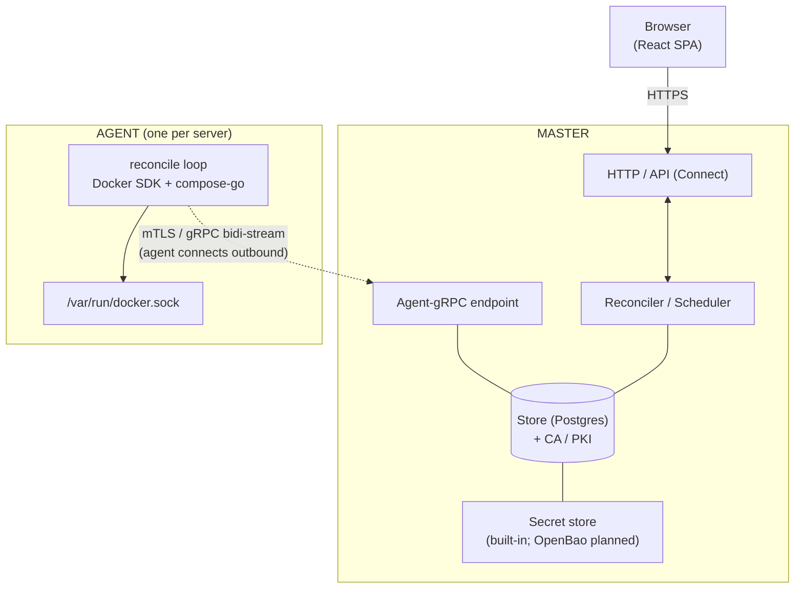

# orkestra — Overview & Architecture

## Why orkestra?

Kubernetes and Nomad are too heavy when all you need is to centrally manage several individual
Docker/Compose hosts. Plain „SSH + docker compose" is not centrally controllable, not self-healing,
and not auditable.

orkestra fills this gap with a **Master-Agent architecture**:

- A lightweight **Agent** (single binary, no runtime) runs on every Linux server and controls
  containers & Compose stacks via the Docker Engine API.
- A central **Master** (runs anywhere, including a container) holds the Desired State, distributes
  it to Agents, and exposes a **Web UI** for management.
- Agents connect **outbound** to the Master (NAT/firewall-friendly), authenticated via **mTLS**.

## Architecture Diagram

> A single Agent's internals are shown; a real fleet has many agents, each dialling the Master
> outbound (see the fan-out diagram in the [README](../README.md)).

## Core Principles

- **Single source of truth:** The Master holds Desired State in PostgreSQL. Agents are stateless
  with respect to configuration — they always derive their target state from the Master.
- **Connect-out:** Agents initiate the connection; the Master never dials out to an Agent. Commands
  are pushed over the established bidirectional stream.
- **Reconciliation over Imperative:** The Master sets a desired state; Agents converge toward it
  continuously and report actual state + drift back.

---

## Tech Stack

| Layer | Choice | Rationale |
|---|---|---|
| Backend language | **Go** (≥ 1.24) | Single binary, official Docker SDK, `compose-go`, cloud-native ecosystem |
| RPC / API | **ConnectRPC** (`connectrpc.com/connect`) | One protobuf schema serves Agents (gRPC/HTTP2, bidi-stream) **and** browsers (Connect/JSON + server-streaming). No separate gRPC-web proxy needed |
| Docker control | `github.com/docker/docker/client` (Engine API) | Direct control without CLI subprocess |
| Compose | `github.com/compose-spec/compose-go/v2` | Official Compose parser → `types.Project` |
| Persistence | **PostgreSQL** + **sqlc** (pgx/v5) for type-safe SQL | External DB; robust concurrency, JSONB indexes, `LISTEN/NOTIFY` for reconciler |
| Migrations | `pressly/goose` | Versioned schema migrations |
| Auth (users) | local: `argon2id`; OIDC: `coreos/go-oidc` + `golang.org/x/oauth2` | Local as default, OIDC optional |
| Secrets | built-in encrypted store (XChaCha20-Poly1305 + KEK); OpenBao backend planned | Built-in works today; pluggable backend designed for later (see `ROADMAP.md`) |
| Logging | `log/slog` (stdlib) | Structured logs |
| Metrics | `prometheus/client_golang` | `/metrics` on Master & Agent |
| Frontend | **React** + TypeScript + Vite; `@connectrpc/connect-web`; TanStack Query; Tailwind | SPA against Connect API; generated TS clients from protobuf |
| Codegen | `buf` for protobuf (Go + TypeScript) | One schema, both languages |
| Packaging | `goreleaser`; systemd units; Docker image | Single-binary distribution |

**Embedding:** The React build (`web/dist`) is embedded via `go:embed` into the Master binary →
one artifact that serves both the API and the UI.

---

## Related Docs

- [01-repo-layout.md](01-repo-layout.md) — Repository structure & build tooling
- [02-protocol.md](02-protocol.md) — gRPC/Connect protocol, protobuf definitions
- [03-data-model.md](03-data-model.md) — PostgreSQL schema
- [04-reconciliation.md](04-reconciliation.md) — Desired-State model & Converge Engine
- [05-secrets.md](05-secrets.md) — built-in secret store, CRUD, reveal, audit
- [06-security-auth.md](06-security-auth.md) — PKI/mTLS, User Auth, RBAC, Audit
- [07-web-ui.md](07-web-ui.md) — UI pages & frontend stack
- [08-deployment.md](08-deployment.md) — Observability & deployment
- [ROADMAP.md](../ROADMAP.md) — planned features & known gaps
