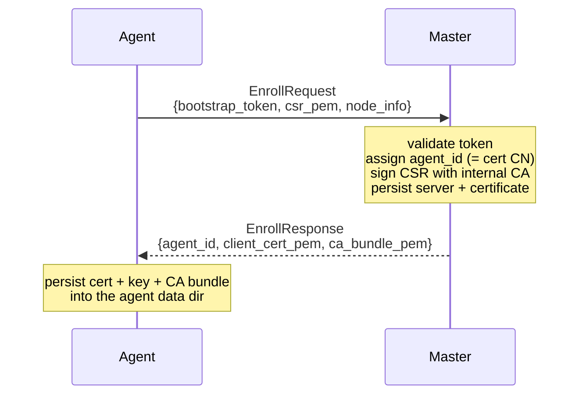
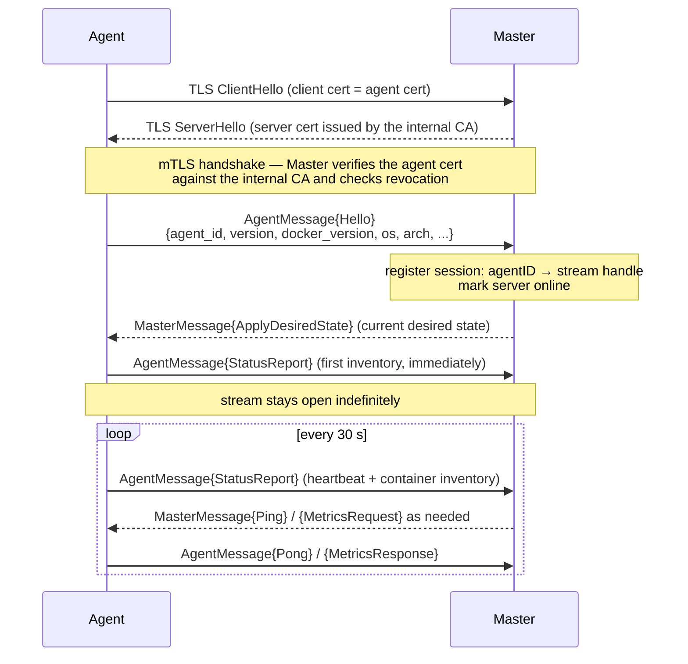
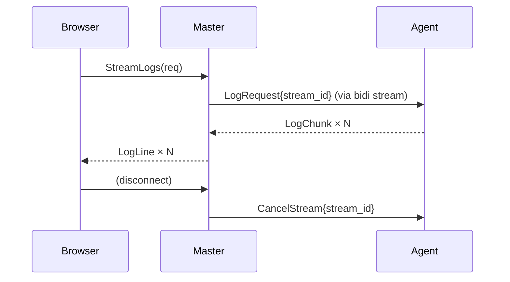

# orkestra — Communication Protocol (gRPC / ConnectRPC)

## Overview

orkestra uses **ConnectRPC** (`connectrpc.com/connect`) as its RPC framework. ConnectRPC is
protobuf-first and serves one schema over two protocols:

- **gRPC** (binary protobuf framing over HTTP/2) — used by the Agent↔Master bidirectional stream.
- **Connect protocol** (JSON or binary, HTTP/1.1 or HTTP/2) — used by the browser SPA, including
  server-streaming. No gRPC-web proxy needed.

One protobuf schema, one Go server, both clients happy.

> **Implementation status.** The message schema below is the full protocol surface. Enrollment, the
> persistent `Connect` stream, `ApplyDesiredState`, heartbeats, cert renewal, and federated agent
> metrics are wired end-to-end. Three paths exist as wire format but are **not wired end-to-end
> yet**: live log/stats streams (`StreamLogs`/`StreamStats` ↔ `LogRequest`/`StatsRequest`),
> container commands (`ExecOnContainer` ↔ `ExecCommand`), and pre-resolved secrets
> (`ResolvedSecret`, see [05-secrets.md](05-secrets.md)).

---

## Connection Lifecycle

### 1. Enrollment (one-time)

Before an Agent can connect, it must be enrolled. This happens once per server.



The `bootstrap_token` is a short-lived, use-limited token created by an operator in the UI. The
Agent generates its own ECDSA keypair and CSR locally; the private key never leaves the server.
The **Master** assigns the agent ID and signs the CSR with that ID as the certificate CN — an agent
cannot choose its own identity through the CSR subject.

Enrollment is the only unauthenticated AgentService RPC; it is rate-limited per client IP.

### 2. Connect (long-lived bidirectional stream)

After enrollment, the Agent opens a persistent bidi-stream authenticated with mTLS:



The agent writes to the stream from a single goroutine (Hello, heartbeats, responses), so message
framing stays well-defined regardless of which subsystem produces a message.

### 3. Reconnect

On any stream error or disconnect:
- The Agent reconnects with **capped exponential backoff** (1 s, 2 s, 4 s … up to 60 s).
- Before each connection attempt the Agent checks its certificate and calls `RenewCert` when less
  than 30 days of validity remain.
- The Master marks an agent `offline` when heartbeats stop arriving.
- On (re)connect, the Master pushes the current desired state again — always in full.

---

## Protobuf Definitions

### `agent.proto` — Agent↔Master stream

```protobuf
service AgentService {
  // One-time enrollment — server TLS only (no client cert yet), token proves identity.
  rpc Enroll(EnrollRequest) returns (EnrollResponse);

  // Persistent bidirectional stream — requires mTLS after enrollment.
  rpc Connect(stream AgentMessage) returns (stream MasterMessage);

  // Agent renews its cert before expiry — requires mTLS with the current cert.
  rpc RenewCert(RenewCertRequest) returns (RenewCertResponse);
}

// ─── Master → Agent ───────────────────────────────────────────────────────────

message MasterMessage {
  string request_id = 15;  // correlation ID; the Agent echoes it in its response

  oneof payload {
    ApplyDesiredState apply_desired_state = 1;
    ExecCommand       exec_command        = 2;
    LogRequest        log_request         = 3;
    StatsRequest      stats_request       = 4;
    CancelStream      cancel_stream       = 5;
    Ping              ping                = 6;
    MetricsRequest    metrics_request     = 7;
  }
}

// Ask the Agent for its current Prometheus metrics; answered with MetricsResponse.
message MetricsRequest {}

message ApplyDesiredState {
  repeated StackDesiredState stacks = 1;  // full desired state for this server
}

message StackDesiredState {
  string                  stack_id     = 1;
  string                  version      = 2;  // stack_version_id
  string                  compose_yaml = 3;
  map<string, string>     env_vars     = 4;  // values from the assignment
  repeated ResolvedSecret secrets      = 5;  // pre-resolved by the Master
  DesiredStatus           status       = 6;  // RUNNING | STOPPED | REMOVED
}

message ResolvedSecret {
  string       name      = 1;  // binding name (env var name or file name)
  bytes        value     = 2;  // plaintext — in-memory only, over mTLS
  SecretTarget target    = 3;  // ENV | FILE | DOCKER_SECRET
  string       env_key   = 4;  // if target = ENV
  string       file_path = 5;  // if target = FILE
}

enum DesiredStatus {
  DESIRED_STATUS_UNSPECIFIED = 0;
  DESIRED_STATUS_RUNNING     = 1;
  DESIRED_STATUS_STOPPED     = 2;
  DESIRED_STATUS_REMOVED     = 3;
}

enum SecretTarget {
  SECRET_TARGET_UNSPECIFIED   = 0;
  SECRET_TARGET_ENV           = 1;
  SECRET_TARGET_FILE          = 2;
  SECRET_TARGET_DOCKER_SECRET = 3;
}

message ExecCommand {
  string      container_id = 1;
  CommandType type         = 2;  // START | STOP | RESTART | PULL | REMOVE | EXEC | PRUNE
  repeated string args     = 3;  // for EXEC
}

message LogRequest {
  string stream_id    = 1;
  string container_id = 2;
  bool   follow       = 3;
  string since        = 4;  // RFC3339 or relative, e.g. "5m"
  int32  tail         = 5;  // 0 = all
  bool   timestamps   = 6;
}

message StatsRequest {
  string          stream_id     = 1;
  repeated string container_ids = 2;  // empty = all managed containers
}

message CancelStream { string stream_id = 1; }
message Ping         { int64 timestamp_ms = 1; }

// ─── Agent → Master ───────────────────────────────────────────────────────────

message AgentMessage {
  string request_id = 15;  // echoed from MasterMessage.request_id

  oneof payload {
    Hello           hello            = 1;
    StatusReport    status_report    = 2;
    LogChunk        log_chunk        = 3;
    StatsChunk      stats_chunk      = 4;
    CommandResult   command_result   = 5;
    DockerEvent     docker_event     = 6;
    Pong            pong             = 7;
    MetricsResponse metrics_response = 8;
  }
}

message MetricsResponse {
  string prometheus_text = 1;  // text exposition format
  string error           = 2;  // non-empty if gathering failed
}

message Hello {
  string agent_id       = 1;
  string agent_version  = 2;
  string docker_version = 3;
  string hostname       = 4;
  string os             = 5;
  string arch           = 6;
  int32  cpu_count      = 7;
  int64  memory_bytes   = 8;
}

message StatusReport {
  repeated StackStatus     stacks            = 1;
  int64                    reported_at_ms    = 2;
  repeated AvailableUpdate available_updates = 3;  // see docs/09-updates.md
}

message AvailableUpdate {
  string layer     = 1;  // 'orkestra' | 'images' | 'os'
  string current   = 2;
  string candidate = 3;
}

message StackStatus {
  string                   stack_id          = 1;
  string                   running_version   = 2;  // stack_version_id; empty while a rollout is mixed
  repeated ContainerStatus containers        = 3;
  bool                     drift_detected    = 4;
  string                   drift_description = 5;
  string                   error             = 6;  // summary of the last reconcile failure
  repeated ServiceError    service_errors    = 7;  // per-service detail behind that summary
}

message ServiceError {  // defined in common.proto, shared with the UI API
  string service_name = 1;
  string error        = 2;
}

message ContainerStatus {
  string container_id  = 1;
  string service_name  = 2;
  string state         = 3;  // running | exited | restarting | ...
  string status        = 4;  // "Up 3 hours"
  int32  restart_count = 5;
  int64  started_at_ms = 6;
  string health        = 7;  // "" (no healthcheck) | starting | healthy | unhealthy
  string name          = 8;  // container name, no leading slash
  string image         = 9;  // image reference as configured
}

message LogChunk   { string stream_id = 1; bytes data = 2; }
message StatsChunk { string stream_id = 1; repeated ContainerStats containers = 2; }

message CommandResult { bool success = 1; string output = 2; string error = 3; }

message DockerEvent {
  string              type         = 1;  // container | image | network | volume
  string              action       = 2;  // start | stop | die | oom | ...
  string              actor_id     = 3;
  map<string, string> attributes   = 4;
  int64               timestamp_ms = 5;
}

message Pong { int64 timestamp_ms = 1; }

// ─── Enrollment ───────────────────────────────────────────────────────────────

message EnrollRequest  { string bootstrap_token = 1; string csr_pem = 2; Hello node_info = 3; }
message EnrollResponse { string agent_id = 1; string client_cert_pem = 2; string ca_bundle_pem = 3; }

message RenewCertRequest  { string csr_pem = 1; }
message RenewCertResponse { string client_cert_pem = 1; string ca_bundle_pem = 2; }
```

`ContainerStats` (inside `StatsChunk`) carries CPU percent, memory usage/limit, network RX/TX, and
block read/write per container.

---

### `stacks.proto` — UI API (Servers, Stacks, Deployments)

```protobuf
service StackService {
  // Servers
  rpc ListServers(ListServersRequest)     returns (ListServersResponse);
  rpc GetServer(GetServerRequest)         returns (Server);
  rpc GetServerState(GetServerStateRequest) returns (ServerState); // last reported inventory
  rpc UpdateServer(UpdateServerRequest)   returns (Server);   // rename, labels
  rpc DeleteServer(DeleteServerRequest)   returns (Empty);    // soft delete

  // Stacks
  rpc ListStacks(ListStacksRequest)       returns (ListStacksResponse);
  rpc GetStack(GetStackRequest)           returns (Stack);
  rpc CreateStack(CreateStackRequest)     returns (Stack);
  rpc UpdateStack(UpdateStackRequest)     returns (StackVersion); // creates a new version
  rpc DeleteStack(DeleteStackRequest)     returns (Empty);

  // Versions & assignments
  rpc ListStackVersions(ListStackVersionsRequest) returns (ListStackVersionsResponse);
  rpc AssignStack(AssignStackRequest)             returns (Assignment);
  rpc UnassignStack(UnassignStackRequest)         returns (Empty);
  rpc RollbackStack(RollbackStackRequest)         returns (Assignment);

  // Validate compose YAML without persisting (syntax + supported-field check)
  rpc ValidateCompose(ValidateComposeRequest) returns (ValidateComposeResponse);

  // Container control (forwarded to the Agent)
  rpc ExecOnContainer(ExecOnContainerRequest) returns (ExecOnContainerResponse);

  // Live streams (server-streaming)
  rpc StreamLogs(StreamLogsRequest)     returns (stream LogLine);
  rpc StreamStats(StreamStatsRequest)   returns (stream ServerStats);
  rpc StreamEvents(StreamEventsRequest) returns (stream Event);
}
```

**Env-var model.** A `StackVersion` carries `compose_yaml` plus `env_var_names` — the *names* of the
variables the version requires. The *values* are supplied per deployment in
`AssignStackRequest.env_values` and stored on the assignment. The same immutable stack version can
therefore run on several servers with different values, and the reconciler ships the assignment's
values in `StackDesiredState.env_vars`.

**`ValidateCompose`** returns a list of `{severity, message, line}` diagnostics produced by the
shared validator (`internal/shared/compose`), which is the same code the Agent uses. The stack
editor renders them inline.

### `auth.proto` — sessions, users, configuration

`AuthService` covers session auth (`Login`, `Logout`, `GetCurrentUser`), user management,
self-service profile/password/email flows, role bindings, OIDC config, password policy, SMTP
config, deployment-wide server config (public URL), enrollment tokens, and API keys. See
[06-security-auth.md](06-security-auth.md).

### `secrets.proto` — secret CRUD

`SecretService` covers `ListSecrets`, `GetSecret`, `CreateSecret`, `UpdateSecret`, `DeleteSecret`,
`RevealSecret` (re-authenticated), and `MigrateProvider`. Metadata only — values never appear in
list/get responses. See [05-secrets.md](05-secrets.md).

---

## Streaming Architecture

### Events (implemented)

`StreamEvents` is served entirely by the Master: it sends the most recent events from the `events`
table, then polls for newer rows and pushes them to the browser until the client disconnects.
Filters for `server_id` / `stack_id` are applied in SQL, and RBAC is checked before the first send.

### Logs & stats (designed, not yet wired)

For per-container telemetry the Master acts as a **bridge** between the browser stream and the
Agent stream:



A `stream_id` (UUID) links `LogRequest`/`StatsRequest`/`CancelStream` on the Agent side to the
browser-facing server-stream. The Master routes chunks through a per-agent stream mux to the right
waiting browser goroutine.

**Backpressure:** the Agent's chunk-producing goroutine blocks on the browser goroutine's channel,
so a slow browser slows the Agent down instead of causing unbounded buffering.

The agent-side streamers (`internal/agent/telemetry`) and the wire messages exist; the Master's
bridge and the Agent's dispatch of `LogRequest`/`StatsRequest` are not connected yet, so
`StreamLogs` and `StreamStats` currently return `CodeUnimplemented`.

### Federated agent metrics (implemented)

The same correlation mechanism is already in production use for metrics: the Master sends
`MetricsRequest` with a `request_id`, the Agent answers `MetricsResponse` with the same ID, and the
Master returns the text to the caller of `GET /api/agents/{id}/metrics`. This is how agent metrics
reach Prometheus without an inbound port on the agent host — see
[08-deployment.md](08-deployment.md).

---

## Ports & Endpoints

| Port | Purpose |
|---|---|
| `4440` | Agent gRPC endpoint (mTLS, HTTP/2 only) — `4440` = orchestra concert pitch A440 |
| `8080` | UI API + SPA (Connect protocol; TLS terminated here or at a reverse proxy) |
| `9090` | Prometheus metrics of the Master (no auth — bind to loopback or firewall it) |
| `9091` | Prometheus metrics of the Agent (local only; federated through the Master) |

Besides the Connect RPC paths, the Master serves a few plain HTTP endpoints on `8080`:
`/healthz`, `/readyz`, `/api/setup` (first-run admin), `/api/audit`, `/api/agents/{id}/metrics`,
and the OIDC routes `/auth/oidc/{status,login,callback}`.

`4440` and `8080` can be merged onto a single external port (e.g. `443`) with a connection-level
router — SNI passthrough for `4440`, TLS termination for `8080`. The default configuration keeps
them separate for simpler firewall rules. See [08-deployment.md](08-deployment.md).
