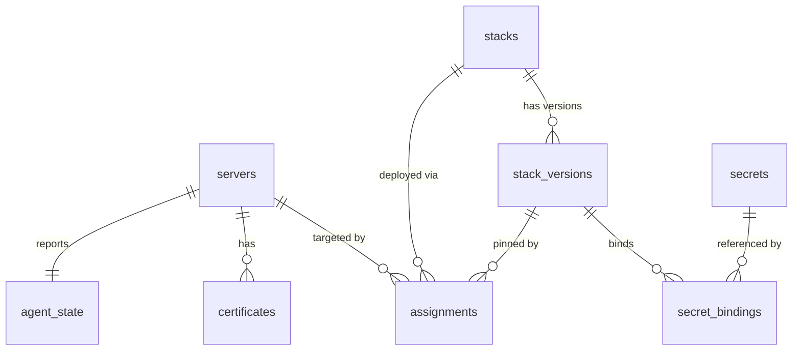

# orkestra — Data Model (PostgreSQL)

## Overview

All persistent state lives in a **PostgreSQL** database on the Master.
The schema is managed with **goose** migrations under `internal/master/store/migrations/`.
Type-safe query code is generated by **sqlc** (pgx/v5) from `internal/master/store/queries/`.

### Desired-state core (relationships)



A server's desired state is the union of its `assignments`; each pins one immutable
`stack_version`. Users/RBAC, sessions, and audit/events tables are omitted here for clarity — see
the full DDL below.

---

## Schema

### PKI / Enrollment

```sql
-- Internal CA (one row, created on first start)
CREATE TABLE ca (
  id           INTEGER PRIMARY KEY,
  cert_pem     TEXT    NOT NULL,
  key_enc      BYTEA   NOT NULL,  -- private key encrypted with KEK (never stored plaintext)
  created_at   BIGINT  NOT NULL   -- Unix ms
);

-- Bootstrap tokens (created by operators in the UI)
CREATE TABLE enrollment_tokens (
  id           TEXT    PRIMARY KEY,  -- UUID
  token_hash   TEXT    NOT NULL UNIQUE,  -- SHA-256 of the raw token (raw token shown once)
  description  TEXT,
  ttl_seconds  BIGINT  NOT NULL,
  max_uses     BIGINT  NOT NULL DEFAULT 1,
  used_count   BIGINT  NOT NULL DEFAULT 0,
  created_by   TEXT    REFERENCES users(id),  -- nullable: first token may be created before any user exists
  created_at   BIGINT  NOT NULL,
  expires_at   BIGINT  NOT NULL,
  revoked      BOOLEAN NOT NULL DEFAULT FALSE
);

-- Certificates issued to Agents
CREATE TABLE certificates (
  serial       TEXT    PRIMARY KEY,  -- hex serial number
  agent_id     TEXT    NOT NULL REFERENCES servers(id),
  fingerprint  TEXT    NOT NULL UNIQUE,
  cert_pem     TEXT    NOT NULL,
  not_before   BIGINT  NOT NULL,
  not_after    BIGINT  NOT NULL,
  revoked      BOOLEAN NOT NULL DEFAULT FALSE,
  revoked_at   BIGINT,
  created_at   BIGINT  NOT NULL
);
```

### Servers (registered Agents)

```sql
CREATE TABLE servers (
  id             TEXT    PRIMARY KEY,  -- UUID assigned at enrollment
  name           TEXT    NOT NULL,     -- human-readable, editable
  hostname       TEXT    NOT NULL,
  arch           TEXT    NOT NULL,     -- amd64 | arm64
  os             TEXT    NOT NULL,
  agent_version  TEXT,
  docker_version TEXT,
  labels         JSONB   NOT NULL DEFAULT '{}',
  status         TEXT    NOT NULL DEFAULT 'offline',  -- online | offline
  last_seen_at   BIGINT,
  enrolled_at    BIGINT  NOT NULL,
  deleted_at     BIGINT              -- soft delete
);

CREATE INDEX idx_servers_status ON servers(status);
```

### Stacks & Versions

```sql
-- Logical stack (a named group of services)
CREATE TABLE stacks (
  id          TEXT    PRIMARY KEY,  -- UUID
  name        TEXT    NOT NULL UNIQUE,
  description TEXT,
  owner       TEXT    REFERENCES users(id),
  created_at  BIGINT  NOT NULL,
  deleted_at  BIGINT
);

-- Immutable stack versions (never updated, only inserted)
CREATE TABLE stack_versions (
  id           TEXT    PRIMARY KEY,  -- UUID
  stack_id     TEXT    NOT NULL REFERENCES stacks(id),
  version      BIGINT  NOT NULL,     -- monotonically increasing per stack
  compose_yaml TEXT    NOT NULL,
  env_vars     JSONB   NOT NULL DEFAULT '{}',  -- {KEY: VALUE} (non-secret)
  secret_refs  JSONB   NOT NULL DEFAULT '[]',  -- [{name, secret_id, target, env_key, file_path}]
  created_by   TEXT    REFERENCES users(id),
  created_at   BIGINT  NOT NULL,
  UNIQUE (stack_id, version)
);

-- Assignments: stack version → server
-- Rollback = create a new assignment pointing to an older version
CREATE TABLE assignments (
  id               TEXT    PRIMARY KEY,  -- UUID
  server_id        TEXT    NOT NULL REFERENCES servers(id),
  stack_id         TEXT    NOT NULL REFERENCES stacks(id),
  stack_version_id TEXT    NOT NULL REFERENCES stack_versions(id),
  desired_status   TEXT    NOT NULL DEFAULT 'running',  -- running | stopped | removed
  assigned_by      TEXT    REFERENCES users(id),
  assigned_at      BIGINT  NOT NULL,
  UNIQUE (server_id, stack_id)  -- one active assignment per server+stack
);
```

### Agent State (Reported Actual State)

```sql
-- Last known actual state per server (JSONB blob, replaced on each StatusReport)
CREATE TABLE agent_state (
  server_id    TEXT    PRIMARY KEY REFERENCES servers(id),
  state_json   JSONB   NOT NULL,  -- {stacks: [StackStatus], reported_at: ms}
  updated_at   BIGINT  NOT NULL
);
```

### Secrets

```sql
CREATE TABLE secrets (
  id          TEXT    PRIMARY KEY,  -- UUID
  name        TEXT    NOT NULL UNIQUE,
  description TEXT,
  provider    TEXT    NOT NULL,     -- 'builtin' | 'openbao'
  -- builtin fields
  ciphertext  BYTEA,                -- encrypted with KEK (NULL for openbao)
  version     BIGINT  NOT NULL DEFAULT 1,
  -- openbao fields
  bao_mount   TEXT,                 -- KV mount path (e.g. "secret")
  bao_path    TEXT,                 -- key path (e.g. "myapp/db-password")
  bao_key     TEXT,                 -- field within the KV secret (default: "value")
  created_by  TEXT    REFERENCES users(id),
  created_at  BIGINT  NOT NULL,
  updated_at  BIGINT  NOT NULL
);

-- Which secret is bound to which stack service (one binding per target)
CREATE TABLE secret_bindings (
  id               TEXT    PRIMARY KEY,
  stack_version_id TEXT    NOT NULL REFERENCES stack_versions(id),
  secret_id        TEXT    NOT NULL REFERENCES secrets(id),
  service_name     TEXT    NOT NULL,  -- compose service name (empty = all services)
  binding_name     TEXT    NOT NULL,  -- name used in compose (env var name or file name)
  target           TEXT    NOT NULL,  -- 'env' | 'file' | 'docker_secret'
  env_key          TEXT,              -- if target=env
  file_path        TEXT,              -- if target=file
  UNIQUE (stack_version_id, service_name, binding_name)
);
```

### Users, RBAC, Auth

```sql
CREATE TABLE users (
  id            TEXT    PRIMARY KEY,
  username      TEXT    NOT NULL UNIQUE,
  display_name  TEXT,
  password_hash TEXT,                  -- argon2id; NULL for OIDC-only users
  oidc_subject  TEXT    UNIQUE,        -- OIDC sub claim
  disabled      BOOLEAN NOT NULL DEFAULT FALSE,
  created_at    BIGINT  NOT NULL,
  last_login_at BIGINT
);

-- OIDC provider config (at most one active row)
CREATE TABLE oidc_config (
  id                INTEGER PRIMARY KEY,
  issuer_url        TEXT    NOT NULL,
  client_id         TEXT    NOT NULL,
  client_secret_enc TEXT    NOT NULL,  -- encrypted with KEK
  scopes            JSONB   NOT NULL DEFAULT '["openid","profile","email"]',
  claim_mapping     JSONB   NOT NULL DEFAULT '{}',  -- {claim: role}
  enabled           BOOLEAN NOT NULL DEFAULT FALSE,
  updated_at        BIGINT  NOT NULL
);

-- Role definitions
CREATE TABLE roles (
  id          TEXT    PRIMARY KEY,
  name        TEXT    NOT NULL UNIQUE,  -- 'admin' | 'operator' | 'viewer' | custom
  description TEXT
);

-- Role bindings (user → role, optionally scoped)
CREATE TABLE role_bindings (
  id          TEXT    PRIMARY KEY,
  user_id     TEXT    NOT NULL REFERENCES users(id),
  role_id     TEXT    NOT NULL REFERENCES roles(id),
  -- optional scope: if NULL, binding applies globally
  server_id   TEXT    REFERENCES servers(id),
  stack_id    TEXT    REFERENCES stacks(id),
  created_at  BIGINT  NOT NULL,
  UNIQUE (user_id, role_id, server_id, stack_id)
);

-- Web sessions
CREATE TABLE sessions (
  id         TEXT    PRIMARY KEY,  -- SHA-256 of the raw session token (raw token sent as cookie only, never stored in DB)
  user_id    TEXT    NOT NULL REFERENCES users(id),
  created_at BIGINT  NOT NULL,
  expires_at BIGINT  NOT NULL,
  last_seen  BIGINT  NOT NULL,
  ip_address TEXT,
  user_agent TEXT,
  revoked    BOOLEAN NOT NULL DEFAULT FALSE
);

CREATE INDEX idx_sessions_expires ON sessions(expires_at);
```

### Audit & Events

```sql
-- Every mutating action (create/update/delete/deploy/start/stop/etc.)
CREATE TABLE audit_log (
  id          BIGINT GENERATED ALWAYS AS IDENTITY PRIMARY KEY,
  ts          BIGINT  NOT NULL,   -- Unix ms
  actor_id    TEXT,               -- user ID or 'system' for reconciler actions
  actor_name  TEXT,
  action      TEXT    NOT NULL,   -- e.g. 'stack.deploy', 'server.delete', 'secret.update'
  target_type TEXT    NOT NULL,   -- 'server' | 'stack' | 'secret' | 'user' | ...
  target_id   TEXT,
  before_json JSONB,              -- snapshot before change (may be NULL)
  after_json  JSONB,              -- snapshot after change
  ip_address  TEXT,
  error       TEXT                -- if the action failed
);

CREATE INDEX idx_audit_ts     ON audit_log(ts DESC);
CREATE INDEX idx_audit_actor  ON audit_log(actor_id);
CREATE INDEX idx_audit_target ON audit_log(target_type, target_id);

-- Live event feed (Docker events, deploy results, reconcile outcomes)
-- Pruned to last 10,000 rows by a background goroutine
CREATE TABLE events (
  id          BIGINT GENERATED ALWAYS AS IDENTITY PRIMARY KEY,
  ts          BIGINT  NOT NULL,
  server_id   TEXT    REFERENCES servers(id),
  stack_id    TEXT    REFERENCES stacks(id),
  event_type  TEXT    NOT NULL,   -- 'docker' | 'deploy' | 'reconcile' | 'agent'
  severity    TEXT    NOT NULL DEFAULT 'info',  -- info | warn | error
  message     TEXT    NOT NULL,
  detail_json JSONB
);

CREATE INDEX idx_events_ts     ON events(ts DESC);
CREATE INDEX idx_events_server ON events(server_id);
```

---

## Key Design Decisions

### Immutable Stack Versions

`stack_versions` are **insert-only** — never updated. This gives us:
- **Rollback** = re-assign to an older `stack_version_id` (no data movement).
- **Audit** = full history of what was deployed, by whom, when.
- **Reproducibility** = a deployment can always be re-run from its exact version record.

### Soft Delete

Servers and Stacks use `deleted_at` instead of hard DELETE. This preserves audit history and
allows recovery. Queries filter `WHERE deleted_at IS NULL`.

### JSONB Columns

`labels`, `env_vars`, `secret_refs`, `state_json` (and other `*_json`/`*_mapping` columns) use
PostgreSQL's `JSONB` type — binary JSON that is indexable and queryable via `->` / `#>>` operators
and GIN indexes. More structured access is handled in Go code (values are surfaced as
`json.RawMessage` by sqlc/pgx).

### KEK (Key-Encrypting Key)

The KEK is a 32-byte random value used to encrypt three columns in the database:
- `ca.key_enc` (CA private key)
- `secrets.ciphertext` (builtin secret values)
- `oidc_config.client_secret_enc`

The KEK is **never stored in the database**. Loss of KEK = loss of access to encrypted data.

The KEK is loaded at Master startup via a pluggable **`KeySource`** (`internal/master/keys/`).
The recommended source is a file mount (`ORKESTRA_MASTER_KEY_FILE`) — a Docker/K8s `secret:`
(tmpfs) or a root-only `chmod 600` file. It must live in a **separate trust domain** from the
database credentials: putting both in the same `.env` file eliminates all protection. See
`docs/06-security-auth.md` § "KEK & KeySource" for the full source table and deployment rules.
