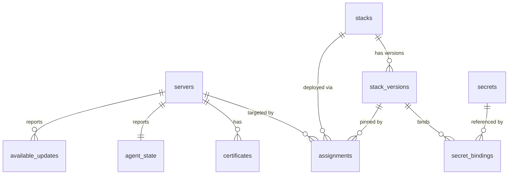

# orkestra — Data Model (PostgreSQL)

## Overview

All persistent state lives in a **PostgreSQL** database on the Master.
The schema is managed with **goose** migrations under `internal/master/store/migrations/`; the
migrations are embedded in the Master binary and applied automatically at startup.
Type-safe query code is generated by **sqlc** (pgx/v5) from `internal/master/store/queries/`.

> The DDL below is the *effective* schema (`00001_initial.sql` plus all later migrations), not a
> copy of any single migration file. Timestamps are Unix milliseconds stored as `BIGINT`.

### Desired-state core (relationships)


```mermaid
erDiagram
  servers        ||--o{ assignments       : "targeted by"
  servers        ||--o{ certificates      : "has"
  servers        ||--|| agent_state        : "reports"
  servers        ||--o{ available_updates : "reports"
  stacks         ||--o{ stack_versions    : "has versions"
  stacks         ||--o{ assignments       : "deployed via"
  stack_versions ||--o{ assignments       : "pinned by"
  stack_versions ||--o{ secret_bindings   : "binds"
  secrets        ||--o{ secret_bindings   : "referenced by"
```

A server's desired state is the union of its `assignments`; each pins one immutable
`stack_version` and carries the env-var values for that deployment.

---

## Schema

### PKI / Enrollment

```sql
-- Internal CA (one row, created on first start)
CREATE TABLE ca (
  id           INTEGER PRIMARY KEY,
  cert_pem     TEXT    NOT NULL,
  key_enc      BYTEA   NOT NULL,  -- private key encrypted with the KEK (never stored plaintext)
  created_at   BIGINT  NOT NULL
);

-- Bootstrap tokens (created by operators in the UI)
CREATE TABLE enrollment_tokens (
  id           TEXT    PRIMARY KEY,
  token_hash   TEXT    NOT NULL UNIQUE,      -- SHA-256 of the raw token (raw shown once)
  description  TEXT,
  ttl_seconds  BIGINT  NOT NULL,
  max_uses     BIGINT  NOT NULL DEFAULT 1,
  used_count   BIGINT  NOT NULL DEFAULT 0,
  created_by   TEXT    REFERENCES users(id) ON DELETE SET NULL,
  created_at   BIGINT  NOT NULL,
  expires_at   BIGINT  NOT NULL,
  revoked      BOOLEAN NOT NULL DEFAULT FALSE
);

-- Certificates issued to Agents (one row per issuance, renewals append)
CREATE TABLE certificates (
  serial       TEXT    PRIMARY KEY,          -- hex serial number
  agent_id     TEXT    NOT NULL REFERENCES servers(id),
  fingerprint  TEXT    NOT NULL UNIQUE,
  cert_pem     TEXT    NOT NULL,
  not_before   BIGINT  NOT NULL,
  not_after    BIGINT  NOT NULL,
  revoked      BOOLEAN NOT NULL DEFAULT FALSE,
  revoked_at   BIGINT,
  created_at   BIGINT  NOT NULL
);
```

### Servers (registered Agents)

```sql
CREATE TABLE servers (
  id             TEXT    PRIMARY KEY,  -- UUID assigned at enrollment; also the client-cert CN
  name           TEXT    NOT NULL,     -- human-readable, editable
  hostname       TEXT    NOT NULL,
  arch           TEXT    NOT NULL,     -- amd64 | arm64
  os             TEXT    NOT NULL,
  agent_version  TEXT,
  docker_version TEXT,
  labels         JSONB   NOT NULL DEFAULT '{}',
  status         TEXT    NOT NULL DEFAULT 'offline',  -- online | offline
  last_seen_at   BIGINT,
  enrolled_at    BIGINT  NOT NULL,
  deleted_at     BIGINT                -- soft delete
);

CREATE INDEX idx_servers_status ON servers(status);
```

### Stacks, Versions & Assignments

```sql
-- Logical stack (a named group of services)
CREATE TABLE stacks (
  id          TEXT    PRIMARY KEY,
  name        TEXT    NOT NULL UNIQUE,
  description TEXT,
  owner       TEXT    REFERENCES users(id) ON DELETE SET NULL,
  created_at  BIGINT  NOT NULL,
  deleted_at  BIGINT
);

-- Immutable stack versions (never updated, only inserted)
CREATE TABLE stack_versions (
  id            TEXT    PRIMARY KEY,
  stack_id      TEXT    NOT NULL REFERENCES stacks(id),
  version       BIGINT  NOT NULL,               -- monotonically increasing per stack
  compose_yaml  TEXT    NOT NULL,
  env_var_names JSONB   NOT NULL DEFAULT '[]',  -- ["KEY", ...] — names only, no values
  secret_refs   JSONB   NOT NULL DEFAULT '[]',  -- [{name, secret_id, target, env_key, file_path}]
  created_by    TEXT    REFERENCES users(id) ON DELETE SET NULL,
  created_at    BIGINT  NOT NULL,
  UNIQUE (stack_id, version)
);

-- Assignments: stack version → server, plus this deployment's env values
-- Rollback = point the assignment at an older version
CREATE TABLE assignments (
  id               TEXT    PRIMARY KEY,
  server_id        TEXT    NOT NULL REFERENCES servers(id),
  stack_id         TEXT    NOT NULL REFERENCES stacks(id),
  stack_version_id TEXT    NOT NULL REFERENCES stack_versions(id),
  desired_status   TEXT    NOT NULL DEFAULT 'running',  -- running | stopped | removed
  env_values       JSONB   NOT NULL DEFAULT '{}',       -- {KEY: VALUE} for this server
  assigned_by      TEXT    REFERENCES users(id) ON DELETE SET NULL,
  assigned_at      BIGINT  NOT NULL,
  UNIQUE (server_id, stack_id)  -- one active assignment per server+stack
);
```

**Where env values live.** A stack version declares only the *names* of the variables it needs
(`env_var_names`); the *values* belong to the assignment (`env_values`). The same immutable version
can therefore be deployed to several servers with different values, and changing a value does not
create a new version.

### Agent State (reported actual state)

```sql
-- Last known actual state per server (JSONB blob, replaced on each StatusReport)
CREATE TABLE agent_state (
  server_id    TEXT    PRIMARY KEY REFERENCES servers(id),
  state_json   JSONB   NOT NULL,  -- protojson of the last StatusReport
  updated_at   BIGINT  NOT NULL
);
```

One row per server, replaced on every `StatusReport` — the report is a full snapshot of the host,
so merging would keep stacks alive that are gone. `state_json` is the protojson encoding of the
`StatusReport` message itself, which keeps the blob's schema tied to the proto rather than to a
second hand-written shape. It backs the container inventory on the server page and the
container→stack resolution `ExecOnContainer` authorises against.

### Updates

```sql
-- Per-(agent, layer) update behaviour; a NULL server_id row is the fleet default.
CREATE TABLE update_policies (
  server_id    TEXT    REFERENCES servers(id) ON DELETE CASCADE,  -- NULL = fleet default
  layer        TEXT    NOT NULL CHECK (layer IN ('orkestra', 'images', 'os')),
  mode         TEXT    NOT NULL CHECK (mode IN ('manual', 'automatic')),
  window_cron  TEXT,
  auto_reboot  BOOLEAN NOT NULL DEFAULT false,
  updated_at   BIGINT  NOT NULL
);
CREATE UNIQUE INDEX idx_update_policies_agent ON update_policies (server_id, layer)
  WHERE server_id IS NOT NULL;
CREATE UNIQUE INDEX idx_update_policies_fleet ON update_policies (layer)
  WHERE server_id IS NULL;

-- Agent-reported "an update is available" per (server, layer).
CREATE TABLE available_updates (
  server_id         TEXT   NOT NULL REFERENCES servers(id) ON DELETE CASCADE,
  layer             TEXT   NOT NULL,
  current_version   TEXT   NOT NULL DEFAULT '',
  candidate_version TEXT   NOT NULL DEFAULT '',
  detail            JSONB  NOT NULL DEFAULT '{}',
  detected_at       BIGINT NOT NULL,
  PRIMARY KEY (server_id, layer)
);
```

See [09-updates.md](09-updates.md) for the model these two tables implement.

### Secrets

```sql
CREATE TABLE secrets (
  id          TEXT    PRIMARY KEY,
  name        TEXT    NOT NULL UNIQUE,
  description TEXT,
  provider    TEXT    NOT NULL,     -- 'builtin' | 'openbao'
  -- builtin fields
  ciphertext  BYTEA,                -- encrypted with the KEK
  version     BIGINT  NOT NULL DEFAULT 1,
  -- openbao fields (reserved; no OpenBao backend is implemented)
  bao_mount   TEXT,
  bao_path    TEXT,
  bao_key     TEXT,
  created_by  TEXT    REFERENCES users(id) ON DELETE SET NULL,
  created_at  BIGINT  NOT NULL,
  updated_at  BIGINT  NOT NULL
);

-- Which secret is bound to which stack service (one binding per target)
CREATE TABLE secret_bindings (
  id               TEXT    PRIMARY KEY,
  stack_version_id TEXT    NOT NULL REFERENCES stack_versions(id),
  secret_id        TEXT    NOT NULL REFERENCES secrets(id),
  service_name     TEXT    NOT NULL,  -- compose service name (empty = all services)
  binding_name     TEXT    NOT NULL,  -- name used in compose (env var name or file name)
  target           TEXT    NOT NULL,  -- 'env' | 'file' | 'docker_secret'
  env_key          TEXT,
  file_path        TEXT,
  UNIQUE (stack_version_id, service_name, binding_name)
);
```

### Users, RBAC, Auth

```sql
CREATE TABLE users (
  id            TEXT    PRIMARY KEY,
  username      TEXT    NOT NULL UNIQUE,  -- an email address
  display_name  TEXT,
  password_hash TEXT,                     -- argon2id; NULL until the invite link is used
  oidc_subject  TEXT    UNIQUE,           -- OIDC sub claim, linked on first SSO login
  disabled      BOOLEAN NOT NULL DEFAULT FALSE,
  sso_only      BOOLEAN NOT NULL DEFAULT FALSE,  -- OIDC-only: local password paths are rejected
  created_at    BIGINT  NOT NULL,
  last_login_at BIGINT
);

-- OIDC provider config (single row)
CREATE TABLE oidc_config (
  id                INTEGER PRIMARY KEY,
  issuer_url        TEXT    NOT NULL,
  client_id         TEXT    NOT NULL,
  client_secret_enc TEXT    NOT NULL,  -- encrypted with the KEK
  scopes            JSONB   NOT NULL DEFAULT '["openid","profile","email"]',
  claim_mapping     JSONB   NOT NULL DEFAULT '{}',  -- {group value: role}
  groups_claim      TEXT    NOT NULL DEFAULT 'groups',
  enabled           BOOLEAN NOT NULL DEFAULT FALSE,
  updated_at        BIGINT  NOT NULL
);

-- Role definitions: admin | operator | viewer | secrets-manager
CREATE TABLE roles (
  id          TEXT    PRIMARY KEY,
  name        TEXT    NOT NULL UNIQUE,
  description TEXT
);

-- Role bindings (user → role, optionally scoped to a server and/or stack)
CREATE TABLE role_bindings (
  id          TEXT    PRIMARY KEY,
  user_id     TEXT    NOT NULL REFERENCES users(id) ON DELETE CASCADE,
  role_id     TEXT    NOT NULL REFERENCES roles(id),
  server_id   TEXT    REFERENCES servers(id),   -- NULL = all servers
  stack_id    TEXT    REFERENCES stacks(id),    -- NULL = all stacks
  created_at  BIGINT  NOT NULL,
  UNIQUE (user_id, role_id, server_id, stack_id)
);

-- Web sessions
CREATE TABLE sessions (
  id            TEXT    PRIMARY KEY,  -- SHA-256 of the raw token (raw token only in the cookie)
  user_id       TEXT    NOT NULL REFERENCES users(id) ON DELETE CASCADE,
  created_at    BIGINT  NOT NULL,
  expires_at    BIGINT  NOT NULL,
  last_seen     BIGINT  NOT NULL,
  ip_address    TEXT,
  user_agent    TEXT,
  revoked       BOOLEAN NOT NULL DEFAULT FALSE,
  oidc_id_token TEXT              -- kept for RP-initiated logout; NULL for local sessions
);

CREATE INDEX idx_sessions_expires ON sessions(expires_at);

-- API keys for non-browser clients (Bearer auth)
CREATE TABLE api_keys (
  id           TEXT    PRIMARY KEY,
  user_id      TEXT    NOT NULL REFERENCES users(id),
  name         TEXT    NOT NULL,
  key_hash     TEXT    NOT NULL UNIQUE,  -- SHA-256 of the raw key (raw shown once)
  created_at   BIGINT  NOT NULL,
  last_used_at BIGINT,
  expires_at   BIGINT,                   -- NULL = never expires
  revoked      BOOLEAN NOT NULL DEFAULT FALSE
);

-- Invite / password-reset / email-change tokens
CREATE TABLE password_reset_tokens (
  id         TEXT   PRIMARY KEY,
  user_id    TEXT   NOT NULL REFERENCES users(id) ON DELETE CASCADE,
  token_hash TEXT   NOT NULL UNIQUE,
  purpose    TEXT   NOT NULL,  -- 'invite' | 'reset' | 'email_change'
  new_email  TEXT,             -- for 'email_change': the address to switch to once confirmed
  expires_at BIGINT NOT NULL,
  used_at    BIGINT,
  created_at BIGINT NOT NULL
);

-- Password rules for local users (single row; 0 = no limit)
CREATE TABLE password_policy (
  id          INTEGER PRIMARY KEY,
  min_length  INT NOT NULL DEFAULT 0,
  special_min INT NOT NULL DEFAULT 0,
  special_max INT NOT NULL DEFAULT 0,
  digit_min   INT NOT NULL DEFAULT 0,
  digit_max   INT NOT NULL DEFAULT 0,
  upper_min   INT NOT NULL DEFAULT 0,
  upper_max   INT NOT NULL DEFAULT 0,
  lower_min   INT NOT NULL DEFAULT 0,
  lower_max   INT NOT NULL DEFAULT 0,
  updated_at  BIGINT NOT NULL DEFAULT 0
);
```

### Deployment configuration

```sql
-- SMTP for invite / reset / email-change mails (single row)
CREATE TABLE smtp_config (
  id           INTEGER PRIMARY KEY,
  enabled      BOOLEAN NOT NULL DEFAULT FALSE,
  host         TEXT    NOT NULL DEFAULT '',
  port         INT     NOT NULL DEFAULT 587,
  username     TEXT    NOT NULL DEFAULT '',
  password_enc TEXT    NOT NULL DEFAULT '',  -- encrypted with the KEK
  from_address TEXT    NOT NULL DEFAULT '',
  starttls     BOOLEAN NOT NULL DEFAULT TRUE,
  updated_at   BIGINT  NOT NULL
);

-- Deployment-wide settings set in the UI (single row)
CREATE TABLE server_config (
  id         INTEGER PRIMARY KEY,
  public_url TEXT    NOT NULL DEFAULT '',  -- browser-facing base URL
  updated_at BIGINT  NOT NULL DEFAULT 0
);
```

`server_config.public_url` takes precedence over `ORKESTRA_PUBLIC_URL` for the OIDC redirect URI,
email links, and the first-run setup link — see [08-deployment.md](08-deployment.md).

### Audit & Events

```sql
-- Mutating actions, written by the service layer
CREATE TABLE audit_log (
  id          BIGINT GENERATED ALWAYS AS IDENTITY PRIMARY KEY,
  ts          BIGINT  NOT NULL,
  actor_id    TEXT,               -- user ID, or NULL/'system' for non-user actions
  actor_name  TEXT,
  action      TEXT    NOT NULL,   -- e.g. 'auth.login', 'user.create', 'secret.reveal'
  target_type TEXT    NOT NULL,   -- 'user' | 'secret' | ...
  target_id   TEXT,
  before_json JSONB,
  after_json  JSONB,
  ip_address  TEXT,
  error       TEXT
);

CREATE INDEX idx_audit_ts     ON audit_log(ts DESC);
CREATE INDEX idx_audit_actor  ON audit_log(actor_id);
CREATE INDEX idx_audit_target ON audit_log(target_type, target_id);

-- Live event feed, streamed to the UI via StreamEvents
CREATE TABLE events (
  id          BIGINT GENERATED ALWAYS AS IDENTITY PRIMARY KEY,
  ts          BIGINT  NOT NULL,
  server_id   TEXT    REFERENCES servers(id),
  stack_id    TEXT    REFERENCES stacks(id),
  event_type  TEXT    NOT NULL,   -- 'docker' | 'deploy' | 'reconcile' | 'agent'
  severity    TEXT    NOT NULL DEFAULT 'info',  -- info | warn | error
  message     TEXT    NOT NULL,
  detail_json JSONB
);

CREATE INDEX idx_events_ts     ON events(ts DESC);
CREATE INDEX idx_events_server ON events(server_id);
```

The `event_type` values above are the defined vocabulary; the Master currently emits `agent`
events (connect / disconnect). Both tables grow without bound — there is no retention job yet. See
[06-security-auth.md](06-security-auth.md) for which actions are audited.

---

## Key Design Decisions

### Immutable Stack Versions

`stack_versions` are **insert-only** — never updated. This gives us:
- **Rollback** = re-point an assignment at an older `stack_version_id` (no data movement).
- **Audit** = a full history of what was deployed, by whom, when.
- **Reproducibility** = a deployment can always be re-run from its exact version record.

Because env-var *values* live on the assignment, changing a value is a deployment change, not a new
version — which keeps the version history about the compose definition itself.

### Soft Delete

Servers and stacks use `deleted_at` instead of a hard `DELETE`. This preserves audit history and
allows recovery; queries filter `WHERE deleted_at IS NULL`.

### Deleting a user

Migration `00004` fixes the foreign keys so that deleting a user is possible without losing
history: sessions and role bindings **cascade**, while `stacks.owner`, `stack_versions.created_by`,
`assignments.assigned_by`, `secrets.created_by`, and `enrollment_tokens.created_by` are set to
`NULL`. The objects the user created survive.

### JSONB Columns

`labels`, `env_var_names`, `env_values`, `secret_refs`, `state_json`, `detail`, and the `*_json`
columns use PostgreSQL's `JSONB` type — binary JSON that is indexable and queryable via `->` /
`#>>` operators. More structured access happens in Go (sqlc/pgx surface them as
`json.RawMessage`).

### KEK (Key-Encrypting Key)

The KEK is a 32-byte random value used to encrypt four things in the database:
- `ca.key_enc` (CA private key)
- `secrets.ciphertext` (built-in secret values)
- `oidc_config.client_secret_enc`
- `smtp_config.password_enc`

The KEK is **never stored in the database**. Loss of the KEK means loss of access to all encrypted
data.

It is loaded at Master startup via a pluggable **`KeySource`** (`internal/master/keys/`). The
recommended source is a file mount (`ORKESTRA_MASTER_KEY_FILE`) — a Docker/K8s `secret:` (tmpfs) or
a root-only `chmod 600` file. It must live in a **separate trust domain** from the database
credentials: putting both in the same `.env` file eliminates all protection. See
[06-security-auth.md](06-security-auth.md) § "KEK & KeySource" for the full source table and
deployment rules.
