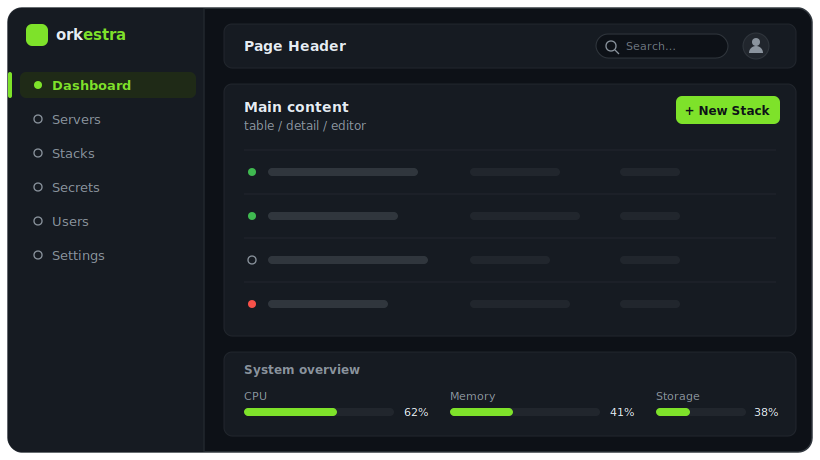

# orkestra — Web UI

## Branding & Visual Design

### Mascot & Logo

Concept: an **orc conductor** in a tuxedo wielding a baton, with Docker-whale containers as
the orchestra. This plays on the name "orkestra" — the orc conducts, the containers play.

- **Tagline:** *"You conduct. We orchestrate."*
- **Logo variants needed:** full illustration (marketing/landing), simplified head icon (app icon,
  favicon), wordmark-only (`ork`**`estra`** with accent colour on `estra`).
- Logo asset directory: `web/src/assets/` (SVG preferred for scalability).

### Colour Palette

| Token | Value | Usage |
|---|---|---|
| Background | `#0d1117` (near-black) | App background, sidebar |
| Surface | `#161b22` | Cards, panels |
| Border | `#21262d` | Dividers, table borders |
| Accent / Brand | `#7ee22a` (lime green) | Active nav item, badges, CTA buttons, progress bars |
| Text primary | `#e6edf3` | Headings, primary content |
| Text muted | `#8b949e` | Labels, secondary info |
| Online green | `#3fb950` | Server/container online status dot |
| Error red | `#f85149` | Errors, drift alerts |

### Layout

Sidebar-based navigation (dark, fixed left) with a main content area — matching the reference:



Key UI details from the reference:
- Status dots (● Online, ○ Offline) in the server/endpoint table
- `+ Add endpoint` / `+ New Stack` primary action buttons (top-right of content area)
- System Overview panel (right rail on dashboard): CPU %, Memory %, Storage, Container count
  — rendered as labelled progress bars
- Sidebar items: Dashboard, Servers, Stacks, Containers, Secrets, Users, Settings

### Tailwind Configuration

Define the palette as Tailwind CSS custom tokens in `web/tailwind.config.ts` so components stay
consistent. Use `shadcn/ui` with a custom dark theme derived from these values.

---

## Tech Stack

| Component | Choice |
|---|---|
| Framework | **React 19** + TypeScript |
| Build | **Vite** |
| API client | **`@connectrpc/connect-web`** + generated clients from protobuf (via `buf`) |
| Data fetching | **TanStack Query** (react-query v5) |
| Styling | **Tailwind CSS v4** |
| Components | **shadcn/ui** (Radix UI primitives + Tailwind) |
| Icons | **Lucide React** |
| Code editor | **Monaco Editor** (for compose YAML editing) |
| Routing | **TanStack Router** (file-based routing) |
| State (global) | React context (auth/session); TanStack Query for server state |

The built `web/dist/` is embedded in the Master binary via `go:embed`. In development, Vite
serves on `localhost:5173` and the Master (built with `-tags dev`) proxies requests to it.

---

## Pages & Features

> **Implementation status.** The pages below describe the intended UI. Most are built and wired
> (Login, Dashboard, Servers, Server Detail, Stacks, Stack Editor, Secrets, Users & Roles, Audit
> Log, Settings, Profile). A few described features are **not yet functional** and are tracked in
> the [roadmap issues](https://github.com/heckertobias/orkestra/issues?q=is%3Aopen+label%3Aroadmap):
> - **Live Logs drawer, Live Stats charts, container exec/terminal** — depend on the streaming
>   pipeline ([#19](https://github.com/heckertobias/orkestra/issues/19), [#20](https://github.com/heckertobias/orkestra/issues/20), [#21](https://github.com/heckertobias/orkestra/issues/21)).
> - **Secret bindings tab & OpenBao secret option / migration** — depend on secret distribution and
>   the OpenBao backend ([#22](https://github.com/heckertobias/orkestra/issues/22), [#23](https://github.com/heckertobias/orkestra/issues/23)).
> - **Updates page** — depends on the update system ([#9](https://github.com/heckertobias/orkestra/issues/9)).

### 1. Dashboard (`/`)

**Purpose:** Bird's-eye view of the fleet.

- **Server cards grid:** each server shows name, status indicator (online ●/offline ○), running
  stack count, alert count (drift / errors), Docker version, arch.
- **Fleet stats bar:** total servers, total containers running/stopped, active deployments in progress.
- **Event feed (right panel):** live-streaming `StreamEvents()` feed — deploy started/finished,
  container OOM, agent reconnected, reconcile errors. Filterable by severity/server/stack.
- **Quick actions:** "Add Server" (creates enrollment token), "New Stack".

### 2. Servers (`/servers`)

**Purpose:** Manage registered servers and their enrollment state.

- Table of all servers: name, hostname, arch, agent version, status, last seen, label badges.
- Actions per row: rename, edit labels, view detail, generate new enrollment token, delete.
- **Enrollment Token dialog:** TTL, max-uses, description → shows token once for `install-agent.sh`.

### 3. Server Detail (`/servers/:id`)

**Purpose:** Deep-dive into a single server.

- **Header:** name, hostname, labels, status, Docker version, Agent version, uptime.
- **Container table:** service, image, state, status, restart count, port bindings.
  - Per-container actions: start/stop/restart/pull/remove, view logs, exec (terminal).
- **Stacks tab:** assigned stacks → current version, desired/actual status, drift badge.
  - Per-stack actions: deploy new version, rollback, stop, unassign.
- **Live Stats tab:** real-time CPU/memory/network charts per container (streaming `StreamStats`).
- **Live Logs panel (drawer):** clicking "Logs" on any container opens a log drawer with
  streaming output (`StreamLogs`), follow-toggle, timestamp-toggle, search filter.
- **Certificates tab:** current Agent cert fingerprint, expiry, rotation history.

### 4. Stacks (`/stacks`)

**Purpose:** Manage compose stacks (definitions, not deployments).

- Table: stack name, description, latest version, server count (deployed to), owner.
- Actions: create, edit (→ new version), delete.
- **Create/Edit Stack dialog:**
  - Name, description.
  - Monaco editor for `compose.yaml` with YAML syntax highlighting.
  - Validation button: parses compose, checks against the supported-fields matrix, shows errors.
  - Environment variables section (non-secret key/value pairs).
  - Secret bindings section: pick secret → service → binding name → target (env/file).
  - "Save as new version" (immutable).

### 5. Stack Detail (`/stacks/:id`)

**Purpose:** Stack history and deployment status.

- **Version history table:** version number, created by, created at, "current" badge.
  - Per-version actions: view compose YAML, diff vs other version, deploy (to which server(s)).
- **Deployments table:** server, assigned version, desired/actual status, last reconcile, drift.
  - Actions: start, stop, rollback to previous version.
- **Version diff viewer:** side-by-side or unified diff of compose YAML between two versions.

### 6. Secrets (`/secrets`)

**Purpose:** Manage secrets across both providers.

- Table: name, provider (builtin/openbao), version, description, last updated, bound stacks.
- **Create/Edit secret dialog:**
  - Name, description.
  - Provider toggle: builtin (password input) or openbao (mount + path + key fields).
  - For builtin: password input (masked). Value transmitted over HTTPS, never shown again unless
    "Reveal" is used.
- **Reveal action:** re-authenticates (confirms password / re-does OIDC), shows plaintext for
  10 seconds. Audit-logged.
- **Bindings tab per secret:** list of stack versions and services that reference this secret.
- Actions: update value (→ increments version + triggers reconcile), migrate builtin→openbao, delete.

### 7. Access Control (`/access`)

Two sub-tabs:

#### Enrollment Tokens
- Table of tokens: description, TTL, max/used uses, created by, expires, revoked.
- Actions: create (→ shows token once), revoke.

#### Server Agent Certs
- Table per server: fingerprint, not-after, revoked status.
- Actions: revoke (forces agent to re-enroll).

### 8. Users & Roles (`/users`)

**(admin only)**

- **Users tab:** table of users (username, display name, provider, roles, last login, disabled).
  - Actions: create local user, edit roles, disable/enable, reset password, delete.
- **Roles tab:** role binding editor — pick user + role + optional scope (server or stack).
- **OIDC Config tab:** configure issuer URL, client ID/secret, scopes, claim→role mapping.
  Enable/disable OIDC.

### 9. Audit Log (`/audit`)

- Paginated, searchable, filterable table: timestamp, actor, action, target type/name, IP, error.
- Filters: actor, action type, target, date range, outcome (success/error).
- Each row expandable: shows before/after JSON diff.

---

## Live Streaming (Server-Sent Events via Connect)

ConnectRPC's server-streaming over HTTP/1.1 uses the **Connect protocol** (SSE-like framing),
which works natively in browsers without WebSocket.

```typescript
// Example: streaming logs in the browser
const logStream = serverStreamClient.streamLogs({
  serverId: "...",
  containerId: "...",
  follow: true,
  tail: 200,
});

for await (const chunk of logStream) {
  appendLine(chunk.data);
}
```

TanStack Query is used for all unary RPCs (auto-caching, refetch-on-focus, etc.). Live streams are
managed with custom React hooks that call `useEffect` + async generator iteration + cleanup on
unmount (`stream.cancel()`).

---

## Dev Mode

```bash
# Terminal 1: Master with dev proxy
make dev-master     # go run ./cmd/orkestra-master --dev (proxies /: to :5173)

# Terminal 2: Vite dev server
cd web && npm run dev   # hot reload on :5173
```

In dev mode, the Master sets `--dev` which swaps the embedded FS for a reverse proxy to
`http://localhost:5173`. This means UI changes are instant without rebuilding Go.
