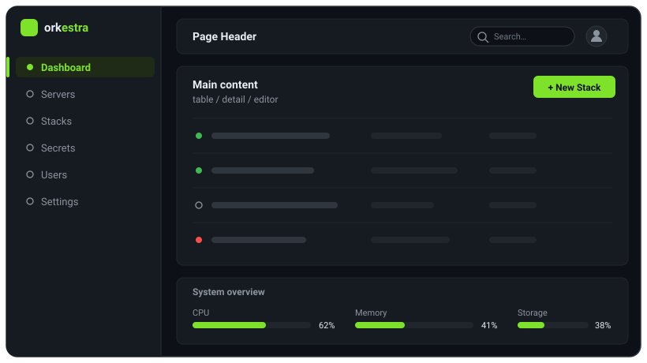

# orkestra — Web UI

## Branding & Visual Design

### Mascot & Logo

Concept: an **orc conductor** in a tuxedo wielding a baton, with Docker-whale containers as the
orchestra. This plays on the name "orkestra" — the orc conducts, the containers play.

- **Tagline:** *"You conduct. We orchestrate."*
- **Variants:** full illustration (marketing/landing), simplified head icon (app icon, favicon),
  wordmark (`ork`**`estra`** with the accent colour on `estra`).
- Assets live in `web/src/assets/` (`logo.webp`, `logo-mark.webp`, `hero.png`) plus
  `web/public/` for favicon and touch icon.

### Colour Palette

The palette is defined once as CSS custom properties in `web/src/index.css` and referenced as
`var(--accent)` etc. throughout the components — there is no `tailwind.config.ts`; Tailwind v4 is
wired in through the `@tailwindcss/vite` plugin.

| Token | Value | Usage |
|---|---|---|
| `--bg` | `#0d1117` (near-black) | App background, sidebar |
| `--surface` / `--surface-2` | `#161b22` / `#1c2128` | Cards, panels, raised rows |
| `--border` | `#21262d` | Dividers, table borders |
| `--accent` / `--accent-dim` | `#7ee22a` (lime green) | Active nav item, badges, CTA buttons |
| `--text` | `#e6edf3` | Headings, primary content |
| `--text-muted` | `#8b949e` | Labels, secondary info |
| `--online` | `#3fb950` | Server/container online status dot |
| `--error` | `#f85149` | Errors, drift alerts |

### Layout

Sidebar-based navigation (dark, fixed left) with a main content area:



The sidebar is role-aware — entries the current user cannot use are not rendered:

| Entry | Visible to |
|---|---|
| Dashboard, Servers, Stacks | every signed-in user |
| Secrets | admin, secrets-manager |
| Users & Roles, Audit Log, Settings | admin |
| Profile (bottom) | every signed-in user |

---

## Tech Stack

| Component | Choice |
|---|---|
| Framework | **React 19** + TypeScript |
| Build | **Vite** |
| Routing | **TanStack Router** (file-based, `web/src/routes/`, generated `routeTree.gen.ts`) |
| Data fetching | **TanStack Query** (v5) |
| API calls | `fetch` against the Connect JSON endpoints (`POST /orkestra.v1.<Service>/<Method>`) |
| Styling | **Tailwind CSS v4** + CSS custom properties |
| Icons | **Lucide React** |
| Code editor | **CodeMirror 6** (`@uiw/react-codemirror`, YAML mode, lint gutter) |
| Tests | **Vitest** (unit tests for `web/src/lib`) |
| State (global) | React context for auth/session; TanStack Query for server state |

Generated Connect clients exist under `web/gen/` (produced by `buf`), but the SPA currently calls
the endpoints with a small hand-written `fetch` wrapper that handles JSON, cookies, and error
mapping (`web/src/lib/`). Streaming endpoints are consumed the same way.

The built `web/dist/` is embedded in the Master binary via `go:embed`. In development, Vite serves
on `localhost:5173` and the Master (built with `-tags dev`) proxies to it.

---

## Routes & Pages

### Public routes

| Route | Purpose |
|---|---|
| `/login` | Local login, "Login with SSO" button when OIDC is enabled, and the first-run admin setup (`?setup=<token>`) |
| `/set-password` | Invite and password-reset landing page (`?token=…`), enforces the password policy |
| `/forgot-password` | Self-service reset request |
| `/verify-email` | Confirms an email change (`?token=…`) |
| `/logged-out` | Landing page after logout, offers ending the IdP session for SSO users |

### Authenticated routes

#### `/` — Dashboard

- Stat tiles: total servers, online, offline, stack count.
- Server table: name, status dot (● Online / ○ Offline), last seen.
- **Event feed:** live `StreamEvents` panel (agent connected/disconnected, and every other event the
  Master records), newest first.

#### `/servers` — Servers

- Table: name, hostname, status, arch, agent version, Docker version, last seen.
- **Add server** dialog: creates an enrollment token (description, TTL, max uses), shows the raw
  token **once** together with a ready-to-paste `orkestra-agent enroll …` command.

#### `/servers/$id` — Server detail

- Header: name, status, hostname, agent version, Docker version, architecture, labels.
- Container table (service, image, state, status, restarts, actions). The agent-state inventory
  that feeds this table is not implemented yet, so it stays empty for now — as do the per-container
  log/stats/exec actions, which depend on the streaming pipeline.

#### `/stacks` — Stacks

- Table: name, description, latest version, created.
- Create leads to the stack editor.

#### `/stacks/new` and `/stacks/$id/edit` — Stack editor

- Name and description.
- **Env variables:** the names the compose file needs. Values are *not* entered here — they belong
  to the deployment (see below).
- **compose.yaml** in a CodeMirror editor with YAML highlighting and inline diagnostics from
  `ValidateCompose` (errors and warnings with line numbers, rendered in the lint gutter).
- Saving creates a new immutable version.

#### `/stacks/$id` — Stack detail

- Version history: version number, author, timestamp, compose YAML.
- Deployments: which server runs which version, desired status, actions (deploy, roll back, stop,
  unassign).
- **Deploy dialog:** pick server + version and fill in the values for the version's declared env
  vars — those values are stored on the assignment, so the same version can run with different
  values per server.

#### `/secrets` — Secrets (admin, secrets-manager)

- Table: name, description, provider, version, binding count, updated.
- Create/edit dialog with a masked value field.
- **Reveal:** asks for the current user's password, then shows the plaintext once. Audit-logged.

#### `/users` — Users & Roles (admin)

- User table: email, display name, roles, status, last login.
- Create user → sends an invite mail; optionally flag the user **SSO-only**.
- **Permission matrix** per user: a global row plus one row per server, each set to
  viewer/operator and optionally narrowed to individual stacks, plus the two standalone toggles
  `admin` and `secrets-manager`. The matrix is folded back into role bindings on save
  (`web/src/lib/rbacMatrix.ts`).
- Per-user actions: edit, send password link, reset password, disable/enable, delete.

#### `/audit` — Audit log (admin)

- Table: time, actor, action, target, IP, error.

#### `/settings` — Settings (admin)

| Tab | Contents |
|---|---|
| General | Public URL (browser-facing base URL used for OIDC redirect, email links, setup link) |
| OIDC | Issuer, client ID/secret, scopes, groups claim, group→role mapping, enable/disable |
| Password policy | Min length, min/max for special characters, digits, upper and lower case |
| SMTP | Host, port, STARTTLS, username, password, from address, enable/disable |
| API keys | Create (shown once), list, revoke |

#### `/profile` — Profile

- Display name, email change (confirmed by mail), password change.

---

## Live Streaming (server-streaming over Connect)

ConnectRPC's server-streaming works natively in the browser over HTTP — no WebSocket needed. The
event feed uses it today:

```typescript
// Server-streamed events, consumed as an async iterable
for await (const event of streamEvents({ serverId })) {
  appendEvent(event)
}
```

Unary RPCs go through TanStack Query (caching, refetch on focus). Streams are managed by custom
hooks: subscribe in `useEffect`, iterate the async generator, cancel on unmount.

`StreamLogs` and `StreamStats` are defined in the schema but not wired end-to-end yet (see
[02-protocol.md](02-protocol.md)), which is why the UI has no log drawer, stats charts, or
container terminal.

---

## Dev Mode

```bash
# Terminal 1: Master with the dev proxy
make dev-master          # builds with -tags dev and proxies / to :5173

# Terminal 2: Vite dev server
cd web && npm run dev    # hot reload on :5173
```

Under the `dev` build tag the Master swaps its embedded filesystem for a reverse proxy to
`http://localhost:5173`, so UI changes are instant without rebuilding Go. Run `npm test` in `web/`
for the Vitest unit tests.
